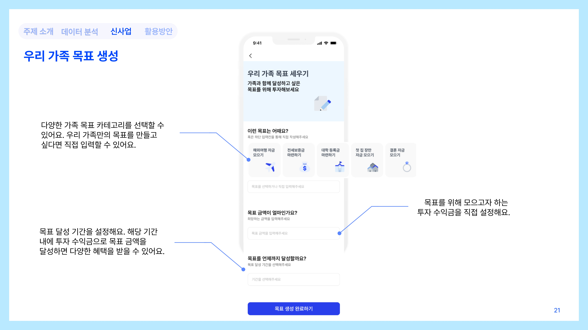
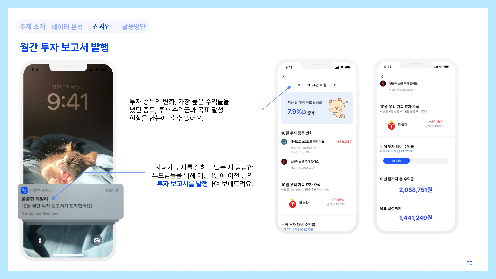

# Shinhan-Hackathon-3rd

(2024) 제3회 신한 빅데이터 해커톤 — 신한 투자 증권 분야

## 소개

🏷 **프로젝트 명 : 투자 인식 개선을 위한 가족 공동 주식 투자 신기능 기획**

🗓️ **프로젝트 기간 : 2024.10.07 ~ 2024.10.11**

👥 **구성원 : 심용석(PM, DA), 김동현(DA), 성원호(DA), 김효민(Product Design)**

🏆 **수상 : 최우수상, 교육부장관상**

---

## 👀 주요 기능
**쏠쏠한(Sol) 패밀리**

자녀 세대에는 투자 기회를, 부모 세대에는 투자 인식을 개선하여 더 많은 세대가 주식 투자에 관심을 가질 수 있도록 하는 신한 투자 증권의 신기능

| 기능 | 설명 |
|------|------|
| 가족 투자 계좌 공유 | 가족 투자 계좌의 투자 현황을 가입된 가족 구성원이 함께 볼 수 있다. |
| 가족 목표 달성을 위한 가족 투자 | 투자 수익금을 모으기 위한 가족 목표를 생성하여 관리할 수 있다. |
| 부모님을 위한 월간 투자 보고서 | 매달 발행되는 가족 투자 계좌의 현황을 보고서를 확인할 수 있다. |

## 📈 분석 배경 EDA
분석 내용을 요약하면, 2030 자녀 세대는 적은 자산으로 인한 투자 진입 장벽으로 높은 이탈율을 보였고, 5060 부모 세대는 안전 자산을 선호하고 소극적인 주식 투자 성향으로 무거래 비율이 높았다. 특히 연령대별 투자 성향 설문조사 결과와 실제 자산 포트폴리오 현황이 정반대(부모 세대는 공격형, 자녀 세대는 안정형)로 나타나, 세대 간 투자 신뢰도의 간극이 크다는 것을 알 수 있었다.

## 👤 고객 타겟팅 Persona

## 🎨 서비스 화면 및 기능 소개

#### 🖥️ 서비스 메인 화면

#### 💰 투자 계좌 현황

#### 🎯 가족 목표 생성

#### 📬 월간 투자 보고서

## 💡 활용방안

#### 💙 사용자 기대 효과

| 효과 | 내용 |
|------|------|
| **👨‍👩‍👧‍👦 세대 간 투자 참여 확대** | 투자에 대한 부모 세대의 두려움 감소 및 관심 증대와 자녀 세대의 투자 경험 증대 |
| **🎯 공동 목표를 통한 투자 동기 부여** | 가족이 함께 공통 목표를 설정하고 달성해나가는 과정에서 투자에 대한 관심 증가 |
| **💬 가족 신뢰 강화** | 실시간 투자 현황 대시보드와 포트폴리오 변화 알림을 통한 투명한 투자 내역 확인 및 가족과의 소통이 증대. |

#### 🏢 신한 금융 그룹 시너지

| 카테고리 | 연계 기회 | 예시 |
|---------|---------|------|
| **보험 연계** | 신한라이프 | 해외여행비 목표 달성 → 여행자보험 보장 제공 |
| **은행 연계** | 신한은행 | 전세 자금 목표 달성 → 우대 금리 혜택 제공 |
| **카드 연계** | 신한카드 | 통신사 요금 목표 달성 → 통신비 할인 혜택을 제공 |
| **라이프스타일** | 기타 | 우리 가족 OTT 구독료 모으기 등 맞춤형 목표 설정 |

